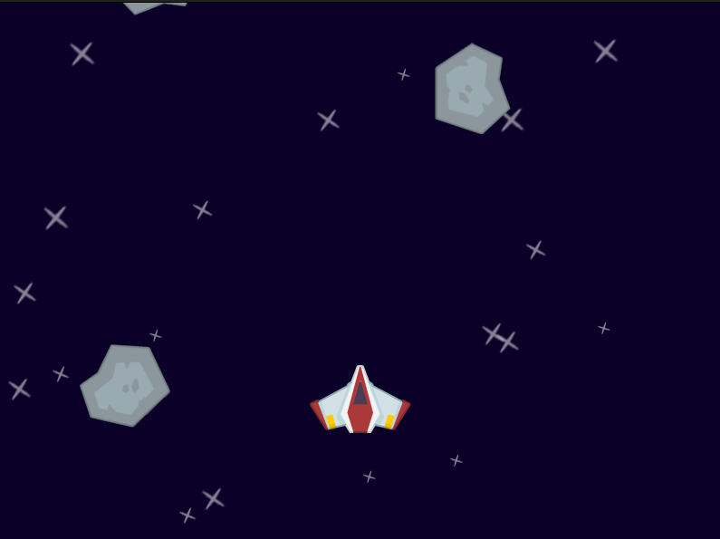

# LÖVE 2D Space Shooter

A simple space shooter game built with the LÖVE 2D game framework.

## Requirements

- [LÖVE 2D](https://love2d.org/) (version 11.0 or higher)

## How to Run

1. Install LÖVE 2D from https://love2d.org/
2. Clone or download this repository
3. Run the game with: `love .` (from the project directory)

## Dependencies

These libraries are included in the vendor folder:

- [hump](https://github.com/vrld/hump) (game utils)
- [lick](https://codeberg.org/usysrc/LICK) (hot reloading)

## Credits

Game assets from: https://github.com/clear-code-projects/5games/tree/main/space%20shooter

This game is heavily inspired from this great Pygame tutorial: https://www.youtube.com/watch?v=8OMghdHP-zs
